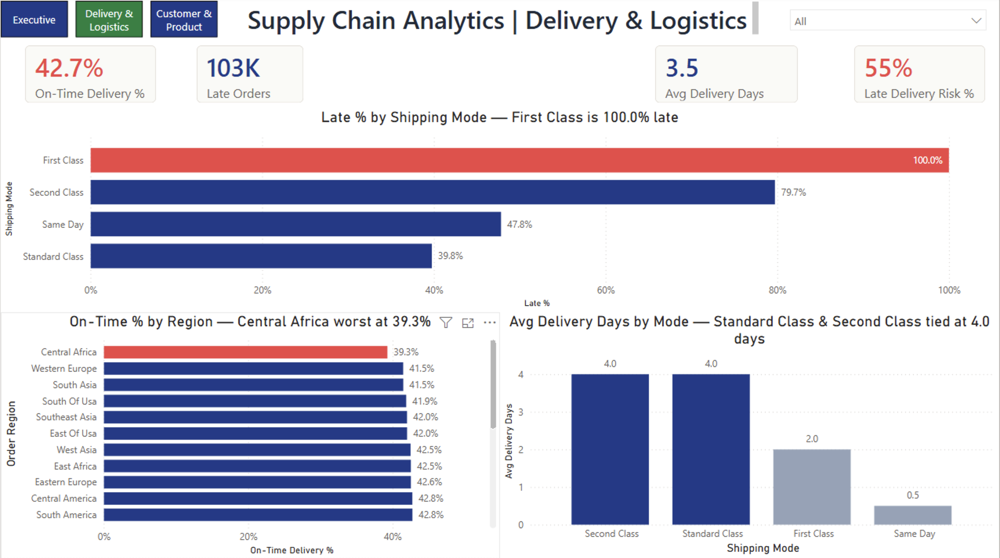
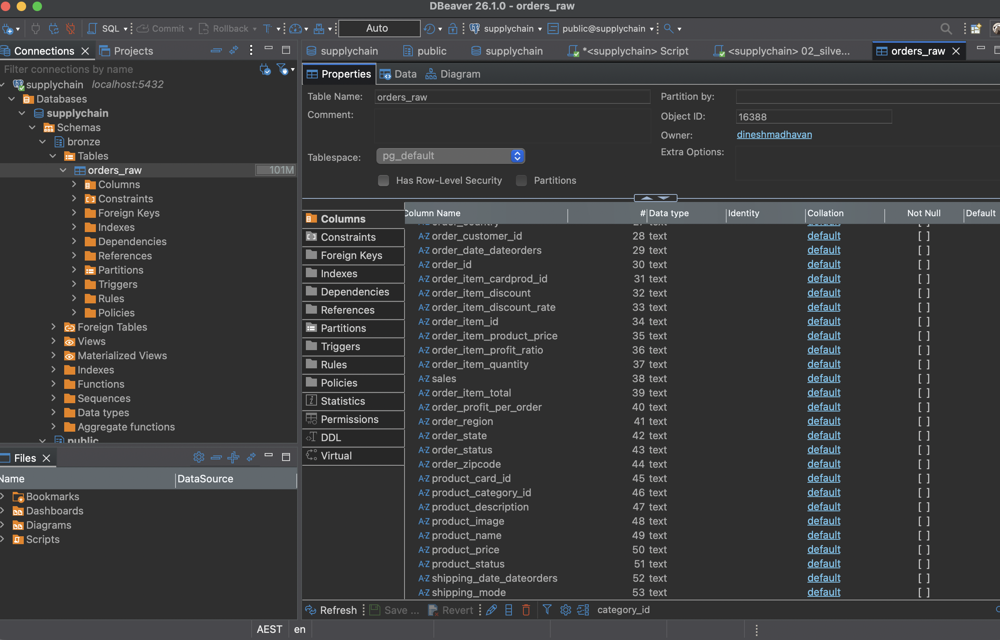
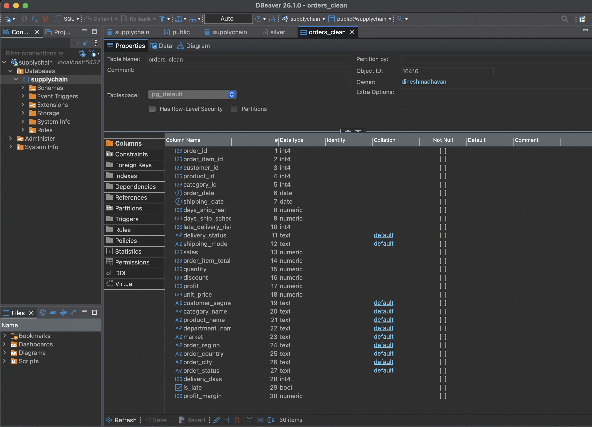
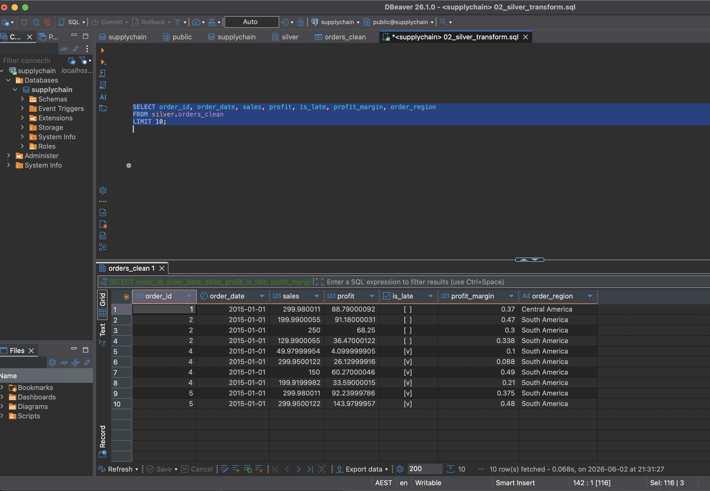
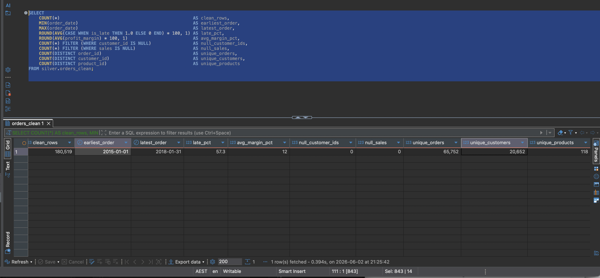
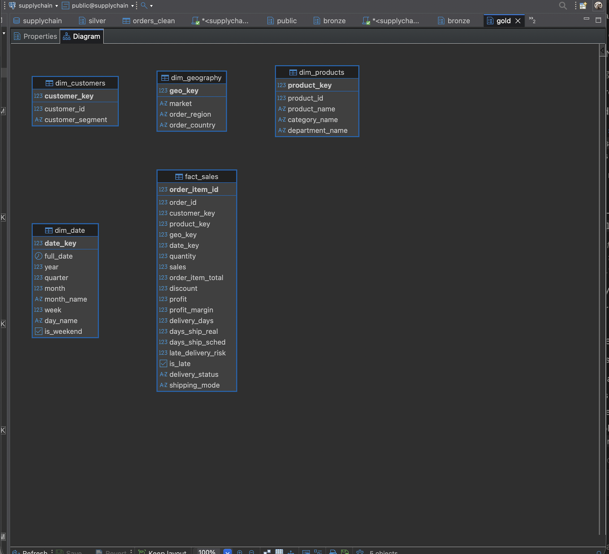
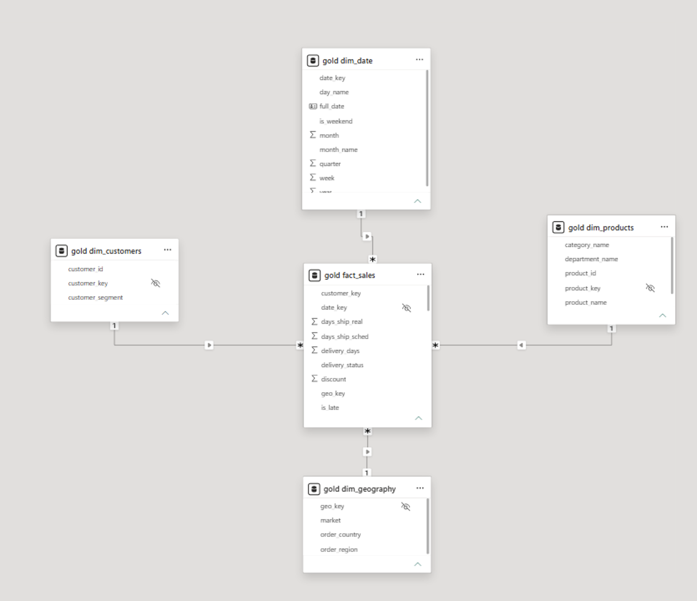
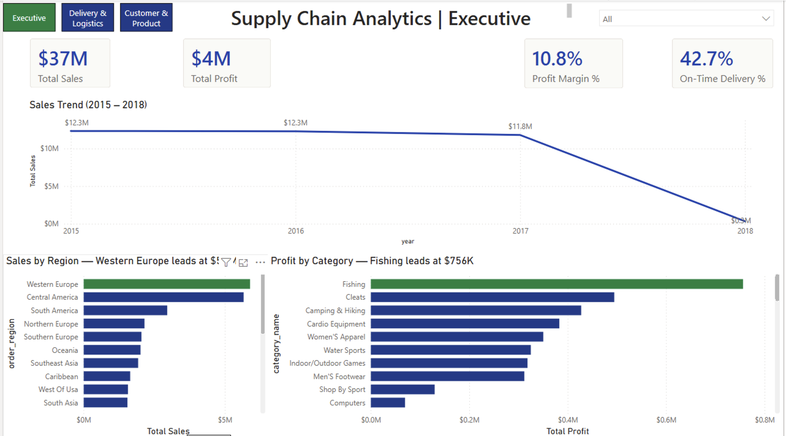
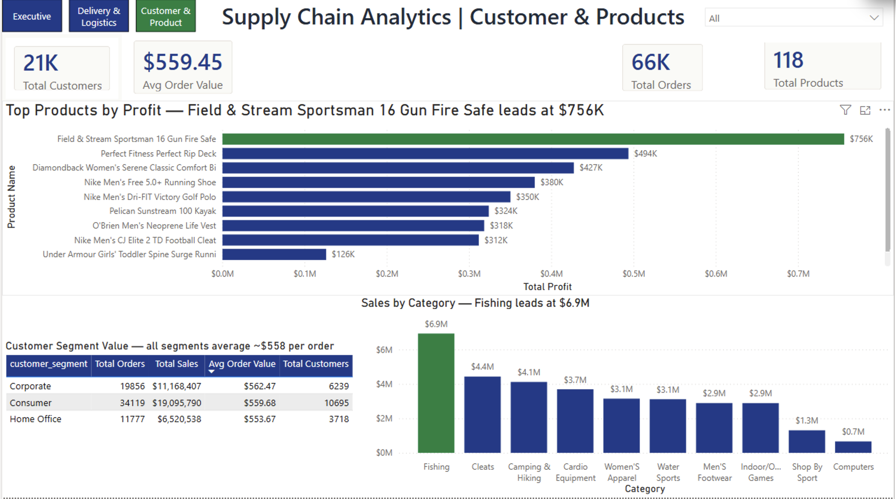

# Supply Chain Analytics — DataCo Case Study



> DataCo Global, a multi-market wholesaler of consumer goods, suspected that delivery performance was deteriorating but lacked a consolidated view of *where* and *why*. This case study presents an end-to-end analysis of three years of order data — 180,519 records, January 2015 to January 2018 — implemented as a medallion pipeline on PostgreSQL with a Kimball star schema feeding a three-page Power BI report.
>
> Three findings shaped the recommendation set: **First Class shipping shows a 100% late-delivery rate in the dataset, Central Africa records the lowest on-time rate at 39.3%, and the Fishing category alone contributes $756K in profit.**

🔗 **Live dashboard** — [Open the interactive Power BI report](https://app.powerbi.com/view?r=eyJrIjoiNDBkYmRmZGItZmVlZC00MWY2LWI4MDAtMjE3Nzc3ZjA2YmRjIiwidCI6ImVhNTA1MzgxLTdjYjEtNDQ4ZC1iZGYzLTRlYTAzMTlhMmQ2ZCJ9)
📓 **Case study** — [Read the full write-up on Notion](https://app.notion.com/p/376090be8222813b9009c38984a81e9a)


---

## Contents

1. [Tech stack](#tech-stack)
2. [Business problem](#business-problem)
3. [The dataset](#the-dataset)
4. [Architecture](#architecture)
5. [Pipeline — Bronze, Silver, Gold](#pipeline--bronze-silver-gold)
6. [Data model — Kimball star schema](#data-model--kimball-star-schema)
7. [Key findings](#key-findings)
8. [Dashboard walkthrough](#dashboard-walkthrough)
9. [DAX measures](#dax-measures)
10. [Recommendations](#recommendations)

---

## Tech stack

| Layer | Tool |
|-------|------|
| Extract | Python · pandas (read CSV, profile data quality) |
| Load | Python · SQLAlchemy (write to Postgres Bronze) |
| Storage | PostgreSQL 16 (Bronze / Silver / Gold schemas) |
| Transform | SQL — window functions, CTEs, `COALESCE`, `INITCAP`, `generate_series` |
| Modelling | Kimball star schema (4 dimensions + 1 fact, surrogate keys) |
| BI | Power BI Desktop + Service |
| BI language | DAX |
| SQL editor | DBeaver |

---

## Business problem

DataCo Global ships consumer goods — sporting gear, apparel, fitness equipment — across four continents, and the operations team had a hunch their delivery performance was slipping. The available source was a 95 MB CSV containing 180,519 order line records across January 2015 to January 2018, making it difficult to explore, model, and report on consistently.

The brief was to answer four questions with one consolidated artefact:

- Where is profit actually coming from?
- How often are orders late, and which shipping modes are the worst offenders?
- Are any regions structurally underperforming?
- Do customer segments behave differently enough to justify differentiated pricing?

The dataset contains the fields needed to answer all four, once it has been cleaned, typed, and modelled into a star schema.

---

## The dataset

[DataCo Smart Supply Chain](https://www.kaggle.com/datasets/shashwatwork/dataco-smart-supply-chain-for-big-data-analysis) on Kaggle — 180,519 rows, 53 columns, January 2015 through January 2018. One row per order line item. Includes sales, profit, customer, geography, shipping mode, and a pre-computed late-delivery risk flag.

Real enough that the cleaning work is real. Synthetic enough that no PII is involved.

---

## Architecture

```
DataCo CSV  →  Bronze (raw)  →  Silver (clean)  →  Gold (star schema)  →  Power BI
   Kaggle      Python load      SQL transform     SQL dimensional       Dashboards
```

A medallion pipeline. Bronze preserves the raw source for auditability, Silver applies typing, deduplication, and derived business columns (`is_late`, `profit_margin`, `delivery_days`), and Gold reshapes the result into a Kimball star schema with one fact table and four dimensions.

PostgreSQL was chosen as a free, production-grade engine that behaves the same as any commercial warehouse at this scale. The same SQL would run on Snowflake or Databricks with only minor syntax changes.

---

## Pipeline — Bronze, Silver, Gold

### Bronze — load it as-is

Script: [`python/01_profile_and_load.py`](python/01_profile_and_load.py)

Before doing anything to the data, get it somewhere queryable. The script profiles the CSV (row counts, nulls, duplicates, numeric ranges) and dumps it into a `bronze.orders_raw` table — every column as text.

```python
df = pd.read_csv(path, encoding="ISO-8859-1", low_memory=False)
df.astype(str).to_sql("orders_raw", engine, schema="bronze",
                      if_exists="replace", chunksize=10_000)
```

The profile printed before load:

```
Rows: 180,519   Columns: 53
Null counts (worst):
  Product Description    180,519 (drop)
  Order Zipcode          155,679 (86% null)
Numeric summary:
  Order Profit Per Order:  min = -$4,275   ← negative profit exists
```

`Product Description` is 100% null and was dropped from downstream stages. Flagging this in the profile before load avoids carrying a useless column through Silver and Gold.



DBeaver view of `bronze.orders_raw` after the Python load — all 53 columns landed as `text`, deliberately. Typing happens in Silver, not here.

### Silver — clean and type

Script: [`sql/02_silver_transform.sql`](sql/02_silver_transform.sql)

This is where typing, deduplication, and the derived business columns happen. Window functions handle the dedup (keeping the most recent shipping date per order line), `CASE` expressions derive `is_late`, and `INITCAP/TRIM` normalise the string columns.

```sql
WITH typed AS (
    SELECT
        NULLIF(order_id, '')::INT  AS order_id,
        TO_TIMESTAMP(order_date_dateorders, 'MM/DD/YYYY HH24:MI')::DATE
            AS order_date,
        ROW_NUMBER() OVER (
            PARTITION BY NULLIF(order_item_id,'')::INT
            ORDER BY shipping_date_dateorders DESC NULLS LAST
        ) AS rn,
        CASE WHEN days_ship_real > days_ship_sched
             THEN TRUE ELSE FALSE END AS is_late
        -- ... more typing + derived columns
    FROM bronze.orders_raw
)
SELECT * FROM typed WHERE rn = 1;
```

Output is `silver.orders_clean` — 180,519 rows, typed, deduped, with `is_late`, `delivery_days`, and `profit_margin` ready to use.



DBeaver view of the resulting `silver.orders_clean` table — 30 columns with proper Postgres types (`int4`, `numeric`, `date`, `bool`, `text`) after the Bronze-to-Silver transform.



Sample 10 rows from `silver.orders_clean` after the transform — dates parsed as `date`, sales and profit as `numeric`, `is_late` as `bool`, and `order_region` normalised with `INITCAP/TRIM`.



Validation aggregate over the full Silver table confirms the transform: **180,519 rows**, date range **2015-01-01 → 2018-01-31**, **57.3% late** overall, **12% average margin**, **zero null `customer_id`s**, **zero null `sales`**, 65,752 unique orders, 20,652 unique customers, 118 unique products.

### Gold — star schema

Script: [`sql/03_gold_star_schema.sql`](sql/03_gold_star_schema.sql)

Four dimensions (customers, products, geography, date) and one fact table. Surrogate integer keys via `ROW_NUMBER()` so the BI joins stay stable even if business IDs change.

```sql
CREATE TABLE gold.dim_customers AS
SELECT
    ROW_NUMBER() OVER (ORDER BY customer_id) AS customer_key,
    customer_id, customer_segment
FROM (SELECT DISTINCT customer_id, customer_segment FROM silver.orders_clean) c;
```

The date dimension is generated, not pulled — Power BI's time-intelligence functions need a continuous date table that includes dates not present in the fact data.

```sql
SELECT generate_series(d0, d1, INTERVAL '1 day')::DATE AS dt
FROM (SELECT MIN(order_date) AS d0, MAX(order_date) AS d1
      FROM silver.orders_clean);
```

---

## Data model — Kimball star schema

Star schema because Power BI's semantic model is designed around it. Single-direction one-to-many relationships on integer surrogate keys keep DAX evaluation simple and predictable, and align with Microsoft's reference guidance for tabular models.



DBeaver's auto-generated ER diagram of the `gold` schema — `fact_sales` at the centre, four conformed dimensions around it (`dim_customers`, `dim_geography`, `dim_products`, `dim_date`), each joined on its surrogate `*_key`.



The same schema rendered inside the Power BI semantic model. `fact_sales` sits at the centre, joined to four dimensions on integer surrogate keys. `dim_date` is marked as the official date table to enable DAX time-intelligence functions (`TOTALYTD`, `DATEADD`, `DATESINPERIOD`).

---

## Key findings

| # | Finding | Number |
|---|---------|--------|
| 1 | First Class late-delivery rate | **100%** in the dataset |
| 2 | Overall late-delivery rate across all modes | **57.3%** |
| 3 | Lowest regional on-time rate | **Central Africa, 39.3%** |
| 4 | Top product by profit | **Field & Stream Sportsman 16 Gun Fire Safe — $756K** (~50% above #2) |
| 5 | Average order value across all segments | **~$560** (no premium tier evidenced) |
| 6 | Revenue concentration | **Western Europe + Central America = ~38%** of total |
| 7 | Profit-margin spread | **~12% across every region** (no margin outliers) |

The First Class result is the most material finding. A 100% late-delivery rate in the dataset indicates either an SLA calibration issue or a carrier performance issue, and warrants escalation to the operations and commercial owners.

---

## Dashboard walkthrough

Three pages. Each one answers a different stakeholder question and uses a consistent visual rhythm and colour system.

### Page 1 — Executive overview



**Executive narration:**

"DataCo generated $37 million in sales over three years and retained $4 million in profit — a ten-percent margin. The trend line is steady from 2015 to 2017 and then drops sharply in 2018. That drop reflects the dataset's end-of-record date in January 2018, not a decline in performance, and should be called out explicitly in any executive summary.

Western Europe is the leading market by revenue. Fishing is the leading category by profit, contributing $756K and well ahead of the next category. These two segments are the strongest candidates for additional marketing investment."

### Page 2 — Delivery & Logistics


**Executive narration:**

"The on-time delivery rate is 42.7%, meaning more than half of all orders are arriving late. The most material number on this page is the red bar: First Class shipping shows a 100% late-delivery rate in the dataset. Although it is priced as the premium tier, it performs worse than every other shipping mode. This points to either an SLA calibration issue or a carrier performance issue.

Central Africa records the lowest on-time rate at 39.3%. The volume is small, but the lane warrants a review with the regional logistics owner. Encouragingly, all other regions cluster tightly around 42% — there is no second outlier in the data."

### Page 3 — Customer & Product



**Executive narration:**

"The Field & Stream Gun Safe drives $756K in profit — more than the next two products combined. It is a flagship product, and stocking levels should be reviewed against demand.

The table at the bottom is the quiet finding: the three customer segments — Consumer, Corporate, and Home Office — all have basically the same average order value, around $560. If leadership has been treating Corporate buyers as a premium segment, the data does not support it. There is an opportunity either to build a real premium tier or to retire the framing."

---

## DAX measures

The measures that drive every visual.

> Tables imported from Postgres land in Power BI as `gold fact_sales`, `gold dim_date` etc. — the schema prefix becomes part of the table name. Names with spaces are wrapped in single quotes in DAX.

```dax
Total Sales        = SUM ( 'gold fact_sales'[sales] )
Total Profit       = SUM ( 'gold fact_sales'[profit] )
Total Orders       = DISTINCTCOUNT ( 'gold fact_sales'[order_id] )
Avg Order Value    = DIVIDE ( [Total Sales], [Total Orders] )
Profit Margin %    = DIVIDE ( [Total Profit], [Total Sales] )

On-Time Delivery % =
DIVIDE (
    CALCULATE ( COUNTROWS ( 'gold fact_sales' ), 'gold fact_sales'[is_late] = FALSE ),
    COUNTROWS ( 'gold fact_sales' )
)

Late % = 1 - [On-Time Delivery %]
```

The "worst region" highlight uses a sample-size guard — regions with fewer than 100 orders are excluded, so a low-volume region with a high lateness percentage is not flagged as a structural outlier.

```dax
Is Worst Region =
VAR CurrVal = [On-Time Delivery %]
VAR WorstValue =
    MINX (
        FILTER (
            ALLSELECTED ( 'gold dim_geography'[order_region] ),
            [Total Orders] > 100
        ),
        [On-Time Delivery %]
    )
RETURN IF ( CurrVal = WorstValue && NOT ISBLANK ( CurrVal ), 1, 0 )
```

---

## Recommendations

1. **Investigate First Class shipping performance end-to-end.** The dataset shows a 100% late-delivery rate for First Class orders, which may indicate an SLA calibration issue, carrier performance gap, or data definition problem. This should be reviewed with a clear owner and remediation plan.
2. **Review the Central Africa delivery lane.** Central Africa recorded the lowest on-time delivery rate at 39.3%. Even if order volume is smaller, the region appears to be a delivery performance outlier and should be reviewed for carrier, fulfilment, or route-level constraints.
3. **Prioritise marketing and inventory planning for the Fishing category.** Fishing generated approximately $756K in profit, making it one of the strongest-performing categories. This suggests an opportunity to review stock availability, demand planning, and targeted marketing investment.
4. **Reassess customer segment positioning.** Average order value was similar across Consumer, Corporate, and Home Office segments, meaning the current data does not show strong segment-level price differentiation. The business could either develop a clearer premium offering or simplify segment-based marketing.
